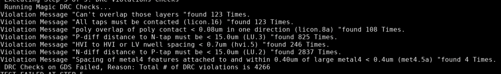
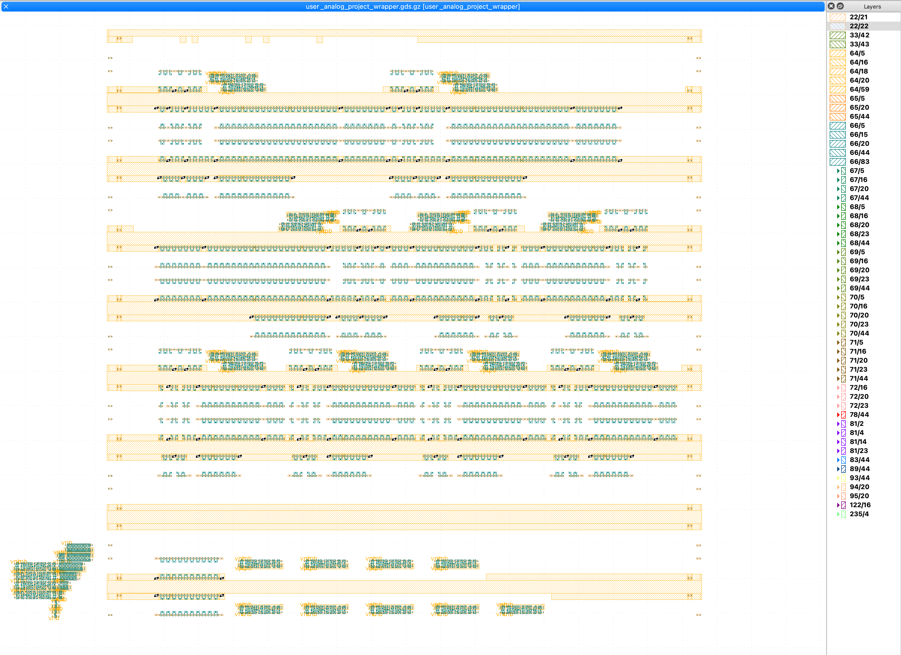
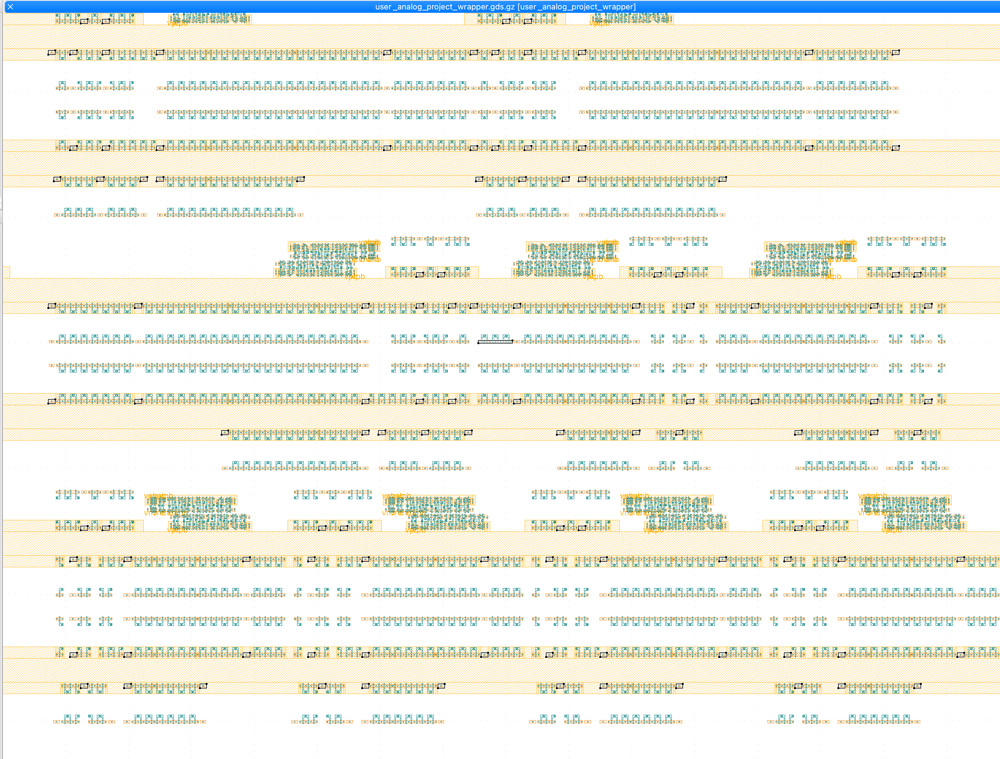
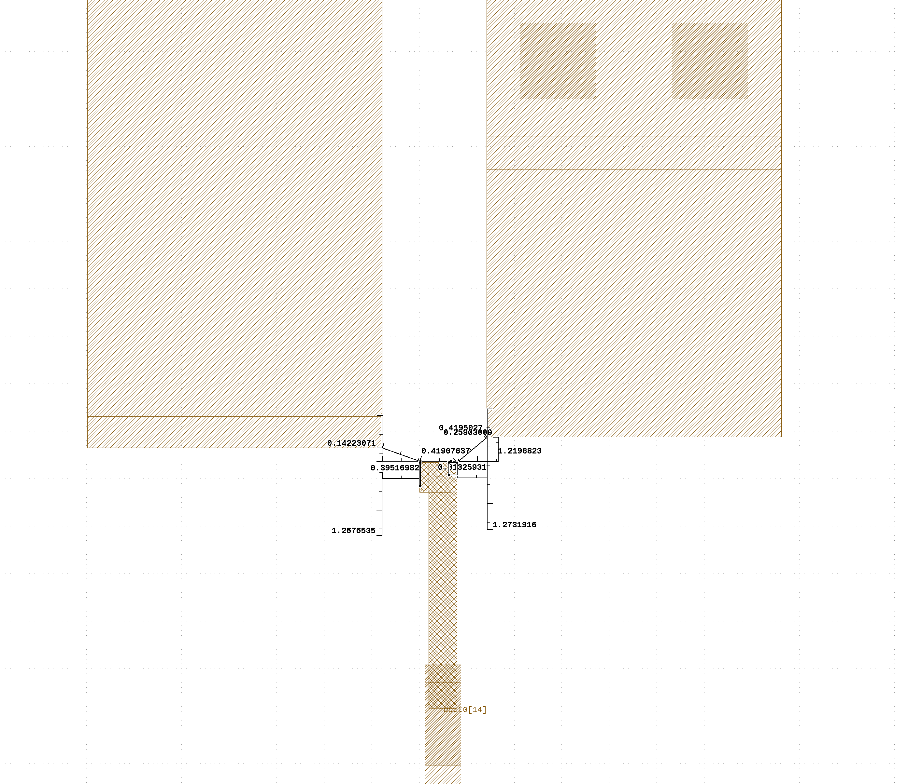
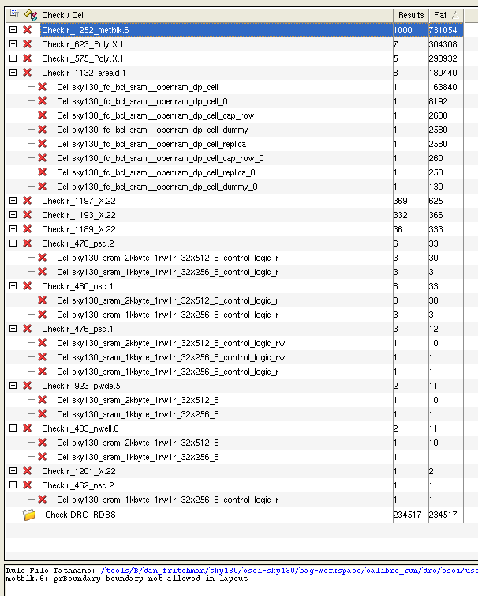

# DRC Waiver Requests and Notes 

UC Berkeley "OsciBear" ChipIgnite Submission  
July 2021 

## Initial Commentary 

The UCB "OsciBear" is designed using a hybrid of the SkyWater 130nm's open-source and NDA'ed PDKs, and a combination of open and closed-source EDA tools. Designers' primary work and verification is performed with commercial EDA tools, notably including design rule checking (DRC). Submission-time checks using the open-source Magic DRC deck are performed on the top-level design. 

This note includes both requests for waivers of the Magic-reported DRC violations, and (hopefully beneficial) commentary on those reported by the UCB team's primary commercial DRC deck. 

## Magic DRC Waiver Requests

The designers of the UCB "OsciBear" request DRC waivers, and assume responsibility for, each of the errors reported on its final submission-check run: 

Commentary on each violation: 

* Latch-Up Errors `LU.2` and `LU.3`
  * The UCB team assumes full responsibility for these violations and their effect on our fabricated IC. 
* Poly-Overlap `licon.8a`
  * These violations are generated by several foundry standard logic cells. 
    The errors have been reviewed and discussed by the UCB and eFabless teams. 
    The UCB team assumes full responsibility for these violations and their effect on our fabricated IC. 

The remaining violations appear to be misinterpretations of the layout by the submission-DRC deck. 
In each case the commercial deck includes a similar rule and does not report similar violations. 

* `licon.16a` - "all taps must be contacted" 

  * This check appears to misinterpret a number of n-well and substrate taps in the design's custom ADC logic. 
  * Notably the commerical deck includes the same rule and does not report this portion of layout as being in violation.
    

  

* "Can't Overlap Those Layers"
  * While this rule does not specify which layers it forbids overlapping, its location-markers indicate n-well and/or substrate taps in the design's custom ADC logic. Like `licon.16`, this appears to be a misinterpretation of the taps, not reported by the commercial deck. 
    

* `hvi.5` - "HVI to HVI or LV n-well spacing" appears due to the same tap-misidentifications
  * Notably this violation is not reported by any of the UCB team's local runs of the submission checks, so available debug information is more limited than for the other checks. 
    

* `met4.5a` - spacing of large & small metal 4 
  * This appears to be a misinterpretation of the 0.4µm minimum distance rule. Neither the Manhattan (sum) nor the direct distance between the reported shapes is less than the minimum 0.4µm. 
  * Notably the commerical deck includes the same rule and same threshold, and does not report this portion of layout as being in violation.
    
    

## Commercial DRC Results and Commentary 

Commercial DRC results for the UCB design are also far from clean, but for very different reasons. 
Violations against the commercial deck are pictured below. Each boils down to one of: 

* Violations inside the OpenRAM-generated SRAMs 
* Violations of non-manufacturability rules, such as undesired layout-boundary layers and floating metals 
* Violations created by the open-source / closed-source cell and device renamings, paired with the commercial deck's filtering of many violations by cell-name. This particularly generates many invalid-transistor-size errors. 

Commentary on each class of violation: 

* `metblk.6` is the most common error, noting the deck's desire to remove `prBoundary` layout-shapes. This can be waived. 
* Each `Poly.X.1` reports an invalid MOS width or length. The violations in standard-cell decaps (`sky130_fd_sc_decap_*`) are due to renamings and cell-name filters in the commercial DRC deck. 
  * The UCB team is unable to verify the validity of these violations in the OpenRAM SRAM cells. 
* Each `X.22` violation reports floating metal, on a variety of layers. These violations do not represent manufacturing or electrical risks to the design; each is added intentionally, e.g. as dummy metal around matched metal capacitors. 
* `areaid.1` is titled "unapproved cells contain areid.ce layer", and boils down to the open/closed PDK renaming of the SRAM bit-cells. It can be waived. 

The remaining violation-reports occur in the OpenRAM SRAM cell periphery: 

* `m2.2` minimum spacing/ notch 
* `m3.2` minimum spacing/ notch 
* `psd.{1,2}` minimum spacing/ notch of psdm 
* `nsd.{1,2}` minimum spacing/ notch of nsdm 
* `pwde.5` "dnwell must be enclosed by pwde_uhvi"
* `nwell.6` min enclosure of newllHole by dnwell 

The UCB team is unable to assess which of these rules and violations might be relaxed by specialty SRAM marker layers or similar rule-modifying annotations. (All occur in the periphery and control logic, so we suspect none.) 

We nonetheless hope these results can aid any of (a) other designers using the OpenRAM macros, (b) the OpenRAM macro designers, or (c) the tape-out verification process. 

